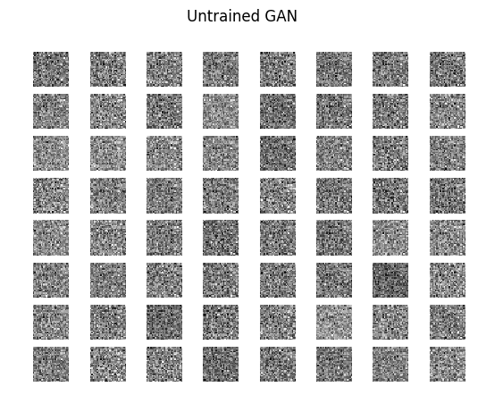
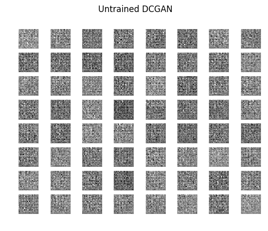

Deep Learning Projects
===============
Repository of the different Deep Learning projects that I'm working on in my spare time. The projects are mostly focused on Computer Vision applications.

For the projects I use the Keras framework with the Theano framworks as backend.

Currently looking into trying out different type of GAN networks, as well as verification and segmentation networks (e.g. siamese networks and UNet). I believe the current GAN results are not ideal, and I'll try and look into whether it is the code or hyperparameters/architecture, as soon as possible.

**Table of Contents**
- [GAN](#gan)
- [DCGAN](#dcgan)
- [Siamese Network](#siamese-network)

GAN
-------------------
Implementation of a simple Fully-Connected based Generative Adversarial Network as proposed by [Goodfellow et al. (2014)](https://arxiv.org/pdf/1406.2661)

### MNIST

### CIFAR10

DCGAN
-------------------
Implementation of a simple Deep Convolutional based Generative Adversarial Network as proposed by [Radford et al. (2015)](https://arxiv.org/pdf/1511.06434)

### MNIST

### CIFAR10

Siamese Network
-------------------
Implementation of a simple Siamese Network which is trained based on the contrastive loss proposed by [Hadsell et al. (2006)](https://cs.nyu.edu/~sumit/research/assets/cvpr06.pdf)

